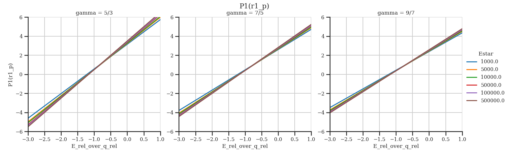
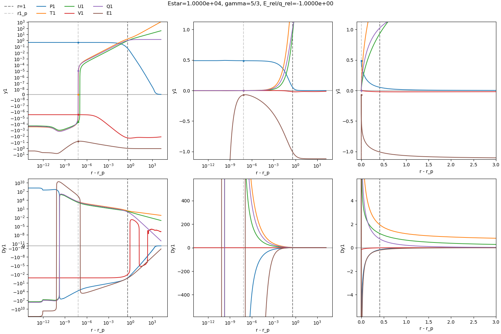

## 2024-01-15

- Reading [Project-Proposal](Project-Proposal.md) again
- Start meeting (explained effect a bit more, overview over project)
- Reading 
- Group meeting

## 2024-01-16

- Read 
- Started reading about deposition dynamics in Oskar's thesis [Vallhagen-Licentiate-2023](Vallhagen-Licentiate-2023.md), tomorrow I'll read 

## 2024-01-17

- Listened to Konrad Steinvall's talk
- Listened to Andreas Gillgren's licentiate defense
- Reading 
- read Oskar Chapter 3 to compare with Pegourie 

## 2024-01-18 to 2024-01-20

- Setup Mendeley as my reference manager
- Read [Senichenkov-2007](Senichenkov-2007.md)
- Attended EUROfusion runaway meeting
- Restructured note-taking workflow -> Obsidian + Zotero + GitHub (I spent way too much time on this, but it was fun)

## 2024-01-22

- Group meeting
- Supervision meeting
	- talked about planning report
	- went through Per's notes together
- tried to figure out where the initial system of equations comes from in Per's notes (Euler equations for gas dynamics?)
	- I couldn't figure out the energy balance equation

## 2024-01-23

- re-did Per's derivation with a general orthogonal basis for the $\theta$-dependence [First_Derivation_of_System_of_Eqs](First_Derivation_of_System_of_Eqs.pdf)
	- started out with general products, for example $\rho_1(r,\theta)=\rho_r(r) \cdot \rho_{\theta}(\theta)$ but this didn't lead to a separation of the $r$- and $\theta$-dependence
	- tried a cosine- and sine-Fourier series, but same problem
	- I don't understand the reason why Per's choices should work out
	- after Oskar helped me a bit I succeeded with the Legendre polynomials, but there are some inconsistencies with Per's notes. Per's equations B and C are probably wrong. And I probably have a sign error somewhere, because both $\alpha_l = \pm 2$ don't fit Per's version.

## 2024-01-24

- there is no sign mistake. (I didn't take into account that d/dx(cosx)=-sinx)
- had a meeting with Per, Tünde, Istvan, Oskar
	- showed them my derived equations
	- Oskar explained that there needs to be 2 extra equations to calculate the heat flux
	- talked about how Parks approached the topic
	- they tried to make a very rough estimate on the order of magnitude of the rocket acceleration, the result was that the stopping length is on the order of 1m times degree of asymmetry, but it was very unclear if the estimate was good, they used as heat flux into the neutral cloud the energy flux of thermal electrons in a typical tokamak plasma and it might be much lower
- derived the rocket force like Per did but with the Legendre polynomial expansion [derivation_force_from_perturbation](derivation_force_from_perturbation.pdf)
	- apparently the rocket force only depends on the l=1 mode, i.e. Per's derivation was already sufficient
	- my note-taking program Onenote decided to delete all my notes so I had to do most of it twice...

## 2024-01-25

- started to write my [Planning Report](Planning%20Report.md)
- discussed the theta dependence with Oskar and showed him my derivation
- meeting with Per, Tünde, Oskar to continue yesterdays discussion
	- the rough estimate was good enough and even though the order of magnitude can vary quite a bit, there are probably some cases where the effect is very important
	- the boundary conditions on the surface of the neutral cloud will be treated as far away (->$\infty$)
	- the problem is very much related to the solar wind problem (with constant temperature in atmosphere)

## 2024-01-26

- talked with Per about the possibility to go to Greifswald for my PhD
- finished a first draft of the [Planning Report](Planning%20Report.md)
- short meeting with Per, Tünde, Oskar to discuss how we can estimate the external heat flux
- read first part of [Parks-1978](Parks-1978.md) paper

## 2024-01-29

- Group meeting
- Supervision meeting
	- gone through planning report
	- gone through Oskars summary
	- next step is getting all equations correct, the way Oskar has them
	- then normalize the equations
- started to go through the derivation again

## 2024-01-30

- derived the set of equations again a bit more clean [full_derivation_more_clean](full_derivation_more_clean.pdf)
- compared with Oskars notes [Summary_by_Oskar_2024-01-29](Summary_by_Oskar_2024-01-29.pdf) and added a few comments where factors of $m$ are missing and one sign was wrong, but generally we got the same system of equations
- I learned a lot about multivariable calculus, directional derivatives and the Jacobian today, also how to properly linearize equations (with Taylor expansion or the usual way)

## 2024-01-31

- rederived the normalized equations for the spherical part that can be solved numerically, which are in Parks paper [normalized_zeroth_order_eqs](normalized_zeroth_order_eqs.pdf)
	- found a mistake we made when copying the dE/dr equation. He divides by $\langle \cos \theta \rangle = 1/2$ which means we should multiply by 2

## 2024-02-01

- I made myself clear what has to be done in order to solve the set of differential equations numerically
- understand Parks method
- transformed the equations to form a boundary value problem from 0 (pellet radius) to 1 (sonic radius)
- outlined all equations I will need in [numerics_outline_spherical_part](numerics_outline_spherical_part.pdf)

## 2024-02-02 and 2024-02-03

- created a GitHub repository for the code of this project and set up the Python environment https://github.com/NicoJG/MastersThesis_Code
- created functions that represent all the equations of the NGS model necessary to solve the ode system numerically
- tried to solve the boundary value problem $r \in [0,1]$ for the unknown parameters $\lambda_*$ and $\eta_*=r_p/r_*$
	- I had a lot of bugs that I tried to solve, for example "divide by zero" or "invalid value encountered" errors
	- once I got rid of the error messages, the solve_bvp function of SciPy just got stuck
	- It seems like the "shooting method" that Parks used is better than the boundary value problem
- switched the code to solve_ivp (initial value problem)
	- It is unclear how to choose and vary $\lambda_*$ exactly
	- I only got unreasonable results so far, where for example the velocity decreases with radius
	- while trying to figure out what is wrong I found some sign errors and small copying mistakes, but they did not change the numerical solution at all
- I have found out that with the events in the solve_ivp function I can stop the integration once the boundary conditions are met
- while thinking about how to vary $\lambda_*$ and later the parameters in the asymmetric part I noticed that both tensorflow and PyTorch have ode solvers and PyTorch even has the events for stopping as well. This might be useful since there it is very easy to calculate derivatives of the parameters with respect to the ode solution

## 2024-02-05

- I changed the method in [solve_ivp](https://docs.scipy.org/doc/scipy/reference/generated/scipy.integrate.solve_ivp.html) from RK45 to Radau and now it solves it much faster and does not get stuck for some values of $\lambda_*$ anymore
- the solutions still vary sometimes strongly depending on which $\lambda_*$ I choose and there is a whole range of $\lambda_*$ where the boundary conditions at $r=r_p$ are met
- Group meeting
- Supervision meeting:
	- I was asked to put the papers on GitHub for convenience. Now they are in the Literature folder
	- The $\lambda_*$ formulas given in the end of Parks Page 1738 are for $\gamma=5/3$ , keep that in mind when comparing
	- it probably works for such a large range of $\lambda_*$ values because the tolerance for the boundary condition is to large -> lower it
	- look into the step size, maybe it is too large at some places
	- the precision we need is basically determined by which ratios in the first order differential equations are important, Oskar suggested $v^2/T$ to be important
- turns out the $dv^2/dr$  singularities at $r=1$ and $r=r_p$ make the calculation very unstable
	- I wanted to detect the singularities with seeing when the denominator becomes very small, but the result I get depends on how small I let it be

## 2024-02-06 and 2024-02-07

- still trying to make the $r=1$ downward calculation more stable
- I have learned a lot from just playing around with parameters and methods:
	- the singularity at $r=1$ does not matter too much as long as Dv^2 > DT the solution does not diverge
	- if T and v^2 approach the same value at lower r, there is another singularity which makes solve_ivp stop with the message "Required step size is less than spacing between numbers.", but this is ok as this will only happen for wrong $\lambda_*$ values
	- In general to achieve the highest possible precision, solve_ivp often "fails" with the mentioned message, but this is alright because it only happens while trying to find the exact boundary
	- for correct $\lambda_*$ values, all $v^2, T, q, E$ are 0 at the pellet radius. I now doubt the stated 15% energy at the pellet surface as Parks stated it. This is only an artifact of numerics
	- I made the algorithm fail less often by setting the absolute tolerance in solve_ivp quite high for E and very small for v2,T,q, because the slope of E diverges at $r_p$ and it goes vertically to 0
- to find the correct $\lambda_*$, it seems to be best to use scipy.optimize.root together with $T(r_p) - q(r_p)$ 
	- I first used scipy.optimize.minimize with $|T(r_p)|+|q(r_p)|$ but this is not smooth when $\lambda_*$ only changes very slightly and the algorithm gets stuck in one of those local minima that might not even be near 0
	- $T(r_p) - q(r_p)$ starts negative for small $\lambda_*$ ($\approx 0.5$) and has a root where both are 0, then it is positive afterwards. It is however only increasing until around $\lambda_* \approx 1.5$, so the starting guess has to be quite low to find the correct root
	- some $\lambda_*$ scans revealed that there are some spikes where $T(r_p) - q(r_p)$ suddenly jumps from positive to negative, this happens sometimes when the $T=v^2$ singularitiy happens before the boundary conditions are fulfilled. I don't think this will ever cause trouble with finding the root though because it only happens for large $\lambda_*$
- since the triggering of the boundary condition often fails, I use the values of the solution where $|T(r_p)|+|q(r_p)|$ is the smallest as I hope this will be closest to the pellet radius the algorithm can overshoot sometimes a bit
- a scan for $\gamma = 5/3$ is somehow quite unstable even around the important $\lambda_*$ values
	- see the following images where $\lambda_*$ is quite close to each other but the shape of the solution is very different. We want something that looks like the left plot, but the right plot somehow also appears in between
	
	- also, for high $\lambda_*$ the $T=v^2$ singularities are very close to each other and this lets the algorithm fail with an error

## 2024-02-08

- I can't reproduce this unstable behavior from yesterday
- Now it seems like the solutions slowly change with lambda (not rapidly like yesterday)
- The root finding algorithm seems to work very well. I find $\lambda_*$ values where $|T(r_p)|+|q(r_p)| \approx 10^{-10}$ and it I have tested it for $E_* = 3*10^2$ to $3*10^7$ and for $\gamma = 7/5$ and $5/3$ and the solutions all look fine
- I have implemented the integration from $r=1$ towards $r \rightarrow \infty$ 
	- I trigger convergence where $(dq/dr + dE/dr - \epsilon) = 0$  , and currently I use $\epsilon = 10^{-20}$, but it even works with $\epsilon = 10^{-200}$ and finds convergence in less than a minute
	- What this is supposed to give me is $q(r\rightarrow \infty)$ and $E(r \rightarrow \infty)$ because we need it for further calculations
- it might be a bit too precise, in the sense that it takes quite long (~1 minute) to calculate $\lambda_* , r_p, E(\infty)$ for a given $E_*,\gamma$ 
- started to derive the normalized set of equations for the first order

## 2024-02-09

- Started to write a concise summary of the project in [Project Summary](Project%20Summary.md), where I keep track of what parts of the project are done and where I am working on.
- Division seminar on "Water drop as an analogy for an atom"
- Started to write code to sweep over multiple $E_\star$ and $\gamma$ values, but somehow the algorithm fails sometimes and I cant figure out why

# 2024-02-10 and 2024-02-11

- I finished recreating the figures in [Parks-1978](Parks-1978.md).
- I started to learn to use [seaborn](https://seaborn.pydata.org/) since this is probably a nicer plotting experience than just using matplotlib
- Found some bugs and inconsistencies on the way:
	- The energy attenuation cross-sections $L(E)$ and $\sigma_T(E)$ now have a (hopefully) reasonable behavior for low energies based on figures in the older Parks paper from 1977. $L(E)$ is only fitted for $E>20 \mathrm{eV}$. I set $L(E<20\mathrm{eV} = 0$. $\sigma_T(E)$ diverges for small energies, therefore I just used the formula in Parks' paper $\sigma_T(E<100\mathrm{eV}) \propto 1/E$.
	- The singularity at $r=1$ is not stable for $E_\star \approx 100\mathrm{eV}$ since $d\Lambda/dE$ has a kink there
	- The pellet radius is now defined as the maximum of $dE/dr$, since it diverges there. I choose this since it works the best and the solve_ivp function sometimes overshoots this point.
	- The events in the solve_ivp function now trigger when any one quantity ($v^2,T,q,E$) passes 0 (negative values don't make sense) or if $v^2=T$ since the singularity would stop the integration either way.
	- In the root finding function to find $\lambda_\star$, I set `tol=1e-5, options={"eps":1e-4}` , which fixed that it took too large steps in the beginning landing at negative $\lambda_\star$ values.
	- The tolerances for the solve_ivp from r=1 down are now ` atol=[1e-10, 1e-10, 1e-10, 1e-3], rtol=1e-7,` This seems to be stable and very precise, and still not too slow
- I realized that we will only have the zeroth order solution at some $r$ values which are almost randomly distributed. For the first order we probably need to do interpolation

## 2024-02-12

- Group meeting
- Supervision meeting:
	-  I showed the recreated figures from Parks paper
	- Oskar talked about one possible way to solve the 1st order ode numerically
	- We have boundary conditions at 0, but potentially diverging derivatives and the zeroth order is not very well defined at the pellet radius
	- So we basically want to treat it as a boundary value problem. We start somewhere close to the pellet radius with setting the quantities to some values, which we then vary until all boundary conditions are fulfilled.
	- This sounds like a problem that's too complex, but maybe it will work
	- I will have to stare at the normalized system of equations a bit to see if there are some other smart ways to solve the system
	- Maybe we could even normalize the asymmetric values to their values at the sonic radius so that we know they are 1 there
- I talked with Oskar afterwards, normalizing to the sonic radius is probably not worthwhile since we have no physics relations that could reduce the number of unknown parameters anyway
- I checked Oskars normalized set of equations (see [normalized_first_order_eqs](HandwrittenNotes/normalized_first_order_eqs.pdf)) and get exactly the same (I only found on factor 2 that was too much in Oskars equations) 
- I thought if we can somehow do some clever stuff to either start at the pellet radius by finding ways around the diverging derivatives or start somewhere else but in some smart way. I did not come up with anything yet. I might just try it numerically the brute force way with 6 unknown parameters.

## 2024-02-13

- Still no clever ideas
- I checked the matrix equation form Oskar has brought the first order ode in. I get almost the same and he probably just had some small mistakes.
- Tried to get a simpler matrix form by plugging everything into Mathematica. It spits out something but I don't know if I did everything correct and if the result is correct. 
- I want to try out sympy. Maybe this yields the same or other results than Mathematica.

## 2024-02-14

- Used sympy to calculate the inverse matrix and the matrix product. Out comes a 6x6 matrix with very large expressions in the upper left 3x3 block.
- I noticed that the facto $T-v^2$ appears infront of the first 3 rows of this matrix
- After talking with Oskar we think it might be possible to use this singularity to eliminate 3 of the first order quantities since the derivatives should be finite at the sonic radius. Tomorrow I will try to use sympy to see if the system of equations for the singularity is useful somehow
- Otherwise I will use the sympy expression for the matrix to calculate the matrix in every step
- Had a meeting with Josefine Proll, about a potential PhD in Greifswald
	- She will connect theory and experiment
	- I have to write her a summary of what my skills are, what I expect to learn and what skills I want to use

## 2024-02-15

- Using sympy, I rederived the singularity of the zeroth order ode (using L'Hopitals rule), to check it and to see how I can do it in sympy
- Using sympy, I derived the first 3 rows of C at the sonic radius
	- this matrix has rank 1. This means that applied to the first order quantities and setting it to equal 0 (since $T-v^2$ is 0 and the derivatives should be finite), all 3 equations are linearly dependent
	- this would allow us to eliminate one of the unknown quantities at the sonic radius
	- however, because of this singularity we would need to find an expression for the derivatives at the sonic radius using L'Hoptials rule
- Using sympy, I tried to apply L'Hopitals rule on the first 3 rows of C. I am now unsure if I did it correctly.
	- Lets call the first 3 rows of C : $C_1$ 
	- $C_1$ has a common prefactor $1/(T-v^2)$
	- I removed this prefactor and then calculated the derivative at the sonic radius
	- Afterwards I also calculated the derivative of $T-v^2$ at the sonic radius and divided the matrix by it
	- I did NOT apply the matrix on any vector and I think this is where I did it wrong
	- This way I required that each component of $C_1$ must be finite and that each component times $T-v^2$ is equal to 0
	- However, the matrix applied to the first order quantities vector must be finite not each matrix element itself
- I think the singularity is not possible to solve using L'Hopitals rule, since we don't know the values at the sonic radius. Or at least it might be to complex to do it this way
- I might just start bruteforcing the solution to the first order ode. Even though it might be possible to eliminate one unknown parameter, this reduction of 1 dimension might not be worth figuring out a way to deal with the singularity
- The singularity will obviously still be there, but I might just hope that we don't need to evaluate the derivatives exactly at the sonic radius 
## 2024-02-19 and 2024-02-20

- Supervision meeting gave me some ideas how to solve the first order system numerically
	- I could try to use gradient based minimization methods
	- I should calculate the cost function not exactly at the pellet radius, slightly besides it should be fine as a first estimate
- Now I derived the derivatives at r=1 and a relation to calculate E1 at r=1
- I should really update this Journal a bit more
	- I should give details on how I solved the zeroth order numerically
	- I should give details on the sympy derivations I did for the first order matrix C, it's L'Hopitals rule and the relation to eliminate E1
	- Once I have found methods that work or do not work I should outline them here
- I have discussed the boundary conditions with Oskar
	- we are pretty sure the singularity relation got rid of one boundary condition but we don't know which
	- maybe U1 and V1 actually don't have to go to 0 at the pellet radius
- I have managed to find a solution using root, that seems pretty good, however, V1 does not go to 0
	- I can't replicate finding this solution from starting guesses
	- It might be just a local minimum
	- scipy.minimize does not find anything to converge to
- since I now check also the boundary conditions at infinity, it might be better to not eliminate E1 at the sonic radius, since we have a quite good starting guess for that

## 2024-02-21 and 2024-02-22

- I tested around a lot to get a feel for the minimization process and what accuracy is achievable
- It seems that V1(r_p)=0 is the boundary condition which when enforced also enforces U1(r_p)=0, P1(inf)=0 is always the case
- A lot of what I did was to see how close the first order pellet radius estimate can get to the zeroth order r_p. 
	- It seems to be the best strategy to use method="hybr" with, which can only handle 5 roots, first to get to some solution that is within 1e-4 to the r_p
	- Then I use method="lm", which is least squares and can handle any number of roots, to go as close as 1e-7 to r_p and enfoce that all boundary conditions go to 0
	- It might work to also have the closeness to r_p as a condition with some weight
	- With this method I can get all boundary conditions fulfilled with at least 1e-5 accuracy
	- I tested it for E_rel/q_rel = +-1
	- this method seems to take somewhere between 3 and 10 minutes
## 2024-02-23

- The method seems to be reliable, I have tested it for the values $E_{rel}/q_{rel} = -2,-1.5,-1,-0.5,-0.1,0.1,0.5,1,2$
- the first order solution shows some very interesting features
	- around -1, V1 is just 0, going to higher fractions it becomes negative and lower fractions it becomes positive
	- this causes P1 to become negative for fractions lower than ~(-1) and thus a force in the opposite direction than expected appears
	- for fractions above ~(+0.5), T1, U1 and V1 are all negative, which seems a bit counter intuitive, since higher incoming heat flux and higher electron energy at $\theta=0$ suddenly means the temperature is higher at $\theta=\pi$ . 
		- Maybe this can be explained by V1 being quite large (but negative) and thus the material is accumulated more towards the low flux side
- I have spent some time to make my code run faster.
	- Oskar gave me the tip to precompute the energy attenuation cross sections. This made me find solutions in 2 instead of 5 minutes.
	- Through profiling I noticed that the interpolation and the calculation of matrix C are the most demanding and I made them a bit faster
- I started to organize my code better
- I have to continue organizing my code and I have to write and outline the procedures I use here in this journal

## 2024-02-29

- today I summarized how to calculate the pellet rocket force after solving the first order differential equations. This is in the handwritten notes [force_from_normalized_1st_order](HandwrittenNotes/force_from_normalized_1st_order.pdf)
- this includes deriving the force in terms of the normalized first order quantities
- as well as deriving an expression for $p_\star$ , which Parks only gives already simplified
- I also put at the end a list of all physical parameters our model depends on
- To see if we can just simplify the dimensionless prefactor in $p_\star$ I also plotted it (see [p_star_dependence_on_E_bg](Images/p_star_dependence_on_E_bg.png))
	- it seems to only depend very weakly on $E_\star$ and $\gamma$ a value of 0.04 might be sufficiently accurate
	- the factor $E_{bg}/\Lambda_\star^{1/3}$ on the other hand is highly nonlinear in $E_{bg}$ 

## 2024-03-01

- I searched for a way to make math work in both Obsidian and on GitHub, since GitHub has some trouble with displaying math. It does not seem to be possible to fix, so for now I stick with the way Obsidian does it. I created a [feature request topic in the Obsidian forum](https://forum.obsidian.md/t/github-gitlab-compatible-math-syntax-with-backticks/77834).
- added my notes on going from the 6 differential equations for the first order to the matrix form $A \vec{y}' = B \vec{y}$ in [first_order_ode_as_matrix_vector_equation](HandwrittenNotes/first_order_ode_as_matrix_vector_equation.pdf). I have used those matrices $A$ and $B$ to calculate $C = A^{-1} \cdot B$ in sympy. (all of this I just added here today, but I have done it much earlier)
- I started to restructure my code to make it more readable and have logical separations between plotting code, scanning code, algorithms and analytical expressions (i did not finish or test it)

## 2024-03-04

- On the weekend I have continued to restructure my code. Now I am almost satisfied with how organised it is. 
- I also did a larger scan for the 0th order and included values of $E_\star$ of up to $10^6 eV$.
- Today I mainly looked into how to get the first order optimization more stable.
- A final minimization might be useful to get the accuracy even further, but it is quite time consuming and doesn't change P1 much (I think)
- The main problem I have with the root finding is that it uses a tolerance in the input parameters to determine when it is done. However, I would like a tolerance on the boundary condition absolute values
- My current approach is to do the root finding and if it does not find low enough boundary condition errors, I add some randomness to the y1sonic and restart the root finding. This is time consuming but mostly this is not guaranteed to find a solution. I would have to restrict the amounts it tries and if it does not find something I should return the best try.
## 2024-03-05 to 2024-03-07

- I now check the boundary condition error sum to be reasonably low after the 1st and 2nd root finding method. If either fails, I try this one again with added randomness to the initial guess. This seemed to be quite stable. At least it is much more consistent than without checking the bc error.
- One of the bottlenecks for the accuracy is that I have to stop the zeroth order solution when E is 20eV, since the energy attenuation cross sections are only defined until 20eV. I just hope that this is precise enough.
- I changed the way I export sympy expressions to not use pickle but just write python code to a file
- I performed a large scan of around 3000 different combinations of $\gamma,E_\star,(E_{rel}/q_{rel})$ 
	- this took around 8 hours to run on my office computer and produced 8GB of data (because I save all full solutions), even with pythons multiprocessing
	- now I can investigate pretty much anything about the found solutions for each parameter combination
	- The main quantity we are interested in is the pressure perturbation, since this is the only quantity of the first order relevant for the force on the pellet (see [force_from_normalized_1st_order](HandwrittenNotes/force_from_normalized_1st_order.pdf))
	- The result is that $P(r_p)$ is a linear function in $E_{rel}/q_{rel}$ with the slope depending weakly on $\gamma,E_\star$. Especially in the relevant range of $E_{rel}/q_{rel}$ around -1 I am certain that it is linear. Below is the corresponding plot (not paper ready) This is scanned from -10 to 10 with a step size of 0.1. I have not investigated if there is some non-linear behavior at $E_{rel}/q_{rel}=0$ but it seems very unlikely
	  
  - Here is one example solution of the first order with showing all quantities and their derivatives on both logarithmic and linear scales for seeing all the details.  
    
- Started writing a detailed documentation of my code for the numerical solution of the 0th order (in [Numerical procedure 0th order](Numerical%20procedure%200th%20order.md)), but I did not get very far

## 2024-03-08 

- Finished writing the detailed documentation of the [Numerical procedure 0th order](Numerical%20procedure%200th%20order.md).

## 2024-03-11

- Had to do some PhD application stuff
- Supervision meeting:
	- I updated everyone on the current status and what I did in the last 2 weeks (restructuring the code, documenting the 0th order code, deriving the final formula for the force, performing large parameter scan)
	- next I need to write the documentation of the 1st order code and go through Oskars ideas on the shielding asymmetry through the ionized ablation cloud
	- since Per Helander is here from 2024-04-08, I need to prepare some slides to be able to update him and present him the results
- I updated the [Project Summary](Project%20Summary.md) 

## 2024-03-19 to 2024-03-21

- went over Oskars ideas on the heat flux asymmetry
- checked his derivations and made the reasoning more clear for myself
	- look into [plasma_cloud_shielding](HandwrittenNotes/plasma_cloud_shielding.pdf)

## 2024-03-27
- almost completed [Project Summary](Project%20Summary.md) to include the plasma shielding estimate
- I adjusted some plots to make them look nicer

## 2024-04-09 and 2024-04-10

- Tried to get rid of the approximation $dE/dr$ and inserted Legendre polynomials to see if it is still possible to decouple $r$ and $\theta$, I did not succeed and I think we have to live with this approximation
- I have found in [Parks, 1977] his reasoning for $dE/ds=dE/dr$. mainly figure 1b
	- The integrated density from infinity to a radius r is does not depend much on which field line the electrons travel on.
	- Contradictory in my mind is that the density near the pellet is the highest and therefore it does matter if we integrate along the field lines or along the radius?
- I have checked the temperature at the sonic radius. It is around 0.5 to 1 eV, if I interpret [Miles, 1972] correctly, there is no significant dissociation or ionization below 10 eV. Therefore, I think we should assume it is a D2 gas and not D. $\Rightarrow \gamma =  7/5$
- I noticed that I have set the plasma cloud temperature to be 2 eV. I do not remember why I did this. In Oskars drift paper he assumes 30 eV. With this the rocket acceleration changes slightly.

## 2024-04-24

- I realized that I should start writing in this diary again
- I have been working on quite a lot of things. LaTeX, visualizations, $q_{rel}=0$ solution, thinking about how to improve the model, ... it's hard to remember everything
- yesterday I have written a first draft of the section "Total force on the pellet"
- today I want to start writing on the neutral gas cloud model
- yesterday night I had a few new ideas how to motivate or improve the $\nabla\cdot\vec{q} \approx \frac{dq}{dr}$ approximation
	- I realized that we do not necessarily need to expand q in Legendre polynomials. 
	- We only need to make sure that the perturbation works, i.e. that we can cancel the 0th order differential equation in the 1st order energy balance equation. 
	- And then we need to find some theta dependence for q, so that projection on the $\cos\theta$ mode gets rid of the theta dependence
	- the best way to think about the heat flux is to think that the electrons travel along the field lines, i.e. $\vec{q}=q\hat{n}$, where $\hat{n}$ is perpendicular to $\hat{z}$ and preferably points in the cylindrical coordinates $\hat{r}$ direction (inwards).
	- with this assumption for $\vec{q}$, it is
	$$
	\nabla\cdot\vec{q} = \hat{n}\nabla q + [q \nabla\cdot\hat{n}] = \sin\theta \frac{\partial q}{\partial r} + \cos\theta \frac{1}{r} \frac{\partial q}{\partial \theta} + [\frac{1}{r \sin\theta}q ]
	$$
	- now we need to find some way how this is approximately $\partial q/\partial r$ 
	- and then we need some form for the perturbation for which the projection on to $\cos\theta$ works
- I have skimmed through some of the papers which tried to improve on the NGS model. Parks himself states "1D model approximation is the removal of the heating anisotropy in the energy equation by substituting the real source $\nabla\cdot\vec{q}$ with a 'fictitious source' $dq/dr$"
- Some models exist for the heat flux which see it as cylindrically symmetric and use Bessel functions for q, I have not understood how they got to this yet. And it is unclear how we can arrive at a 1D model, like we have currently.
- Today has not been productive! I tried to write on describing the NGS model, but instead I have mostly read some papers, for example the beginning of Parks paper. When trying to write something I get overwhealmed and don't know how much I need to write, how to structure it and to write everything correctly. I'm a bit worried that I will not have enough time to finish my thesis. Now I have 4 weeks left and I have written like 4 pages...

## 2024-04-25
- today was a bit more productive and I managed to write the overall model for the neutral gas shielding until the point where the spherically symmetric equations have to derived
- I just had the thought that I should look into some of the papers mentioned by Pegourie if the plasma shielding model we developed should maybe only be used to describe the degree of asymmetry. Because the NGS model uses the pure background plasma q and E and it works well.
- Also, I just reread Pers initial notes. Maybe it is worth it to describe his thoughts on comparing the rocket force to the pellet velocity to have a measure if it is significant

## 2024-04-26
- unfortunately, again a quite unproductive day.
- I have read over what I have written yesterday, and improved a few points
- otherwise, I have written like half a page on the NGS model equations
- a lot of time was spend on non-writing activities like listening to a talk about Radar at the division seminar and planing my writing a bit with Tünde and Istvan
- we decided that I should only focus on necessary background and only mention stuff like disruptions, shattered pellet injection and ablation homogenization
- also, i should finish around 1 chapter per week now and send it to Oskar, Tünde, Istvan and Sarah on the Fridays

## 2024-04-27

- I noticed while plotting $\sigma(E)$, it looks different from the figure 3 in Parks 1977 paper. I do think this is more of a mistake by parks, but hopefully this does not matter too much.
- I wrote about the normalization of Parks equations today, about 1 page

## 2024-04-29

- Today I have written about the numerical solutions to the NGS model, which is around 2-3 pages.
- I need to make the plots for the NGS model fit perfectly into the thesis
- As always, I have also fixed a few things in the parts before, so that it fits better together.

## 2024-04-30

- Today I have written about the derivation of the non-normalized equations for our perturbative model. It takes up almost 3 pages.
- I realized that this whole chapter is very very equation heavy. Maybe it is a bit hard to read. But I guess I will wait what my supervisors say about that.

## 2024-05-01

- I just thought about: Do I have to make clear which ideas are from whom? For example, a lot of ideas come from Per and Oskar, but I do not mention them in my thesis.
- I wrote about the normalization of the perturbation equations
- I even gave the expressions derived by SymPy, in the appendix. This is probably too much, but since the appendix does not really matter I thought I'd just provide it for completeness.
- I also worked a lot on making the plots more nice

## 2024-05-02

- I realized that I did not mention that both $v_0$ and $v_{1,r}$ automatically go to zero at the pellet surface. Not sure how important that is.
- I spend a lot of time today making the 1st order plots look nicer
- I realized that the structure of my thesis might not be optimal, because I am mixing method, results and discussion a lot
- I stated that "Linear regression has shown relative errors to the results of less than $1\%$.", which is true, but somehow I deleted the code where I have shown this. I might need to write the code for plotting this again.
- I almost finished the section about the numerical 1st order solution today. I wrote almost 3 pages

## 2024-05-03

- I have written about $q_{rel}=0$ and I have shown that only $p_1$ is important for the rocket force
- I have written all the figure captions
- I have proofread the whole asymmetry model section, I am not really satisfied with the quality of this text, but I will wait for the comments until I change anything
- I have found a bug in my code. I forgot that concatenating the upwards and downwards solution leads to $r=1$ being in the array twice. This messed up interpolation and I saw it because the vectors at r=1 were missing in the velocity vector field. I fixed it by removing duplicates after concatenation
- Sent the draft of chapter 4 to my supervisors
- I have checked on https://mariechatfield.com/simple-pdf-viewer/ if my figures are colorblind safe. Of course some stuff is hard to distinguish, but overall I would say most of the important detail are visible with any colorvision deficiency. What will help even more is when I annotate the line in the example solutions directly instead of having a legend to the right

## 2024-05-06

- I have spend a lot of time yesterday to figure out how to match the fonts in matplotlib to the fonts in LaTeX. The end result is that the only way to make it look completely coherent is to use TeX in matplotlib.
- Today, I created the illustration for the plasmoid shielding, largely inspired by Oskars illustration
- I started to write about the plasmoid shielding, I wrote 1.5 pages

## 2024-05-07 to 2024-05-09

- I wrote about the plasmoid shielding

## 2024-05-10

- I adjusted the illustrations a bit to denote the different radii
- I researched a bit to find experimental results for the pellet rocket acceleration which we could compare to. I did not really find anything. It might be best to compare to Samulyak's presentation and generally say that the order of magnitude of $10^5 \mathrm{m/s^2}$ is found in other papers.
- Today I could not focus and have basically written nothing