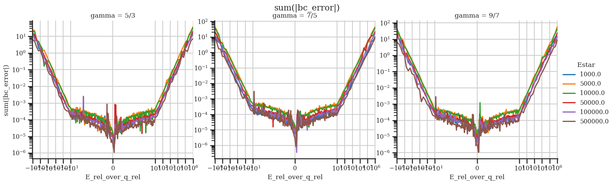

This document aims at giving all details to reproduce exactly how this project computes the numerical solutions to the anisotropic perturbation part of the neutral ablation cloud around the pellet. This document basically serves as a documentation of the Python code of this project, but without the need to read any of the code. 

Since the procedures are similar to solving the zeroth order and the zeroth order solution is a prerequisite here, it is beneficial to have read [Numerical procedure 0th order](Numerical%20procedure%200th%20order.md) to fully understand this document.
To get an overview how this document fits into the whole project, read the [Project Summary](Project%20Summary.md).

# Introduction

The $\theta$-dependence of the neutral ablation cloud fluid dynamics are taken as at perturbation to the zeroth order of the form $T(\vec{r}) = T_0(r) + \sum_l T_l(r) \cdot X_l(\theta)$ , where $X_l(\theta)$ are the [associated Legendre polynomials](https://en.wikipedia.org/wiki/Associated_Legendre_polynomials). Important for the pellet rocket force is only the $l=1$ mode ($X_1(\theta)=\cos\theta$). A system of 6 differential equations describing the 6 physical quantities 
$$
\vec{y}_1(r)=\left[P_1(r), T_1(r), U_1(r), V_1(r),Q_1(r),E_1(r) \right]^T
$$  
 is derived in [full_derivation_more_clean](HandwrittenNotes/full_derivation_more_clean.pdf). For convenience and consistency with the code, slightly different symbols are used here than in the derivations, for example $E_1$ instead of $\mathcal{E}_1$. 

The quantities are normalized using their values at the sonic radius (denoted with a star) and the relative asymmetry factor of the background heat flux $q_{rel}$ in the normalized form $P_1 = \widetilde{P}_1/p_\star q_{rel}$ and the new system of differential equations is derived in [normalized_first_order_eqs](HandwrittenNotes/normalized_first_order_eqs.pdf). It is written in the matrix-vector form 
$$A(r) \cdot \frac{d \vec{y}_1'}{dr} = B(r) \cdot \vec{y}_1(r) \quad \Leftrightarrow \quad \frac{d \vec{y}_1'}{dr} = C(r) \cdot \vec{y}_1(r)$$  
in [first_order_ode_as_matrix_vector_equation](HandwrittenNotes/first_order_ode_as_matrix_vector_equation.pdf), where $\vec{y}_1$ contains the normalized first order quantities and the matrices $A,B$ depend on the normalized zeroth order $\vec{y}_0$, the heat capacity ratio $\gamma$ and the incoming electron energy at the sonic radius $E_\star$. In combination with the boundary conditions 
$$
\begin{gather}
T_1(r_p) = 0,\quad Q_1(r_p)=0,\quad U_1(r_p)=0,\quad V_1(r_p)=0 \\
P_1(\infty) = 0,\quad Q_1(\infty)=q_0(\infty),\quad E_1(\infty)=E_0(\infty)\cdot\frac{E_{rel}}{q_{rel}}
\end{gather}
$$  
this matrix differential equation fully describes the anisotropic perturbation and can be solved numerically for a choice of $\gamma,E_\star,\frac{E_{rel}}{q_{rel}}$.

Goal of the procedures described here is to find a numerical solution $\vec{y}_1(r)$ which satisfies both the differential equation and the boundary condition. For this purpose the integration starts at $r=1$ and $\vec{y}_1(r=1)$ has to be optimized according to the boundary conditions. Together with the zeroth order quantities and a value of $q_{rel}$ all physical perturbation quantities can be calculated. Especially $\widetilde{P}_1(r_p)$, which is important for the pellet rocket force.

# Procedure overview

Before the numerical calculations can start, several things needed to be calculated analytically ($C=A^{-1}\cdot B$, eliminate one $y_{1,i}(r=1)$, $C_\star=C(r=1)$). Since this part is done in a Jupyter Notebook `derivations_1st_order.ipynb` containing [SymPy](https://www.sympy.org/en/index.html) code it is described in a section of this document. 

These SymPy derived expressions are combined into the function `ode1` which calculates $d\vec{y}_1/dr$ for a given $\vec{y}_1(r)$. Additionally to the scalar parameters $\gamma$,$E_\star$,$\lambda_\star$, the zeroth order solution together with its derivative is needed.

This function is then used to iteratively build the solution $\vec{y}_1(r)$ starting from $r=1$ downwards and upwards in `solve_ode1` using [scipy.optimize.solve_ivp](https://docs.scipy.org/doc/scipy/reference/generated/scipy.integrate.solve_ivp.html). Apart from the zeroth order parameters, the parameters that are unknown here are the first order solution at the sonic radius $\vec{y}_1(r=1)$. Since it is possible to eliminate one of those 6 unknowns, this quantity is expected to be `NaN`. (except for $P_1$ any quantity can be chosen)

Optimizing these 5 unknown sonic quantities so that the solution satisfies the boundary conditions at the pellet radius and at infinity is done in `find_ode1_params` using [scipy.optimize.root](https://docs.scipy.org/doc/scipy/reference/generated/scipy.optimize.root.html). Again, the zeroth order parameters $\gamma$,$E_\star$,$\lambda_\star$ have to be chosen and a corresponding zeroth order solution needs to be provided. The additional free parameter $(E_{rel}/q_{rel})$ can be chosen independently from the zeroth order and is the main parameter of the first order.

All of this can be combined to perform a parameter scan and the results are shown at the end of this document.

# Derivation of $C=A^{-1}\cdot B$ and handling of the sonic singularity

As previously mentioned, the differential equation is of the form $\frac{d \vec{y}_1'}{dr} = C(r) \cdot \vec{y}_1(r)$, where $C=A^{-1}\cdot B$ has to be calculated from the derived expressions of $A$ and $B$ in [first_order_ode_as_matrix_vector_equation](HandwrittenNotes/first_order_ode_as_matrix_vector_equation.pdf). Therefore, the starting expressions put into SymPy are
$$
A(r) = \begin{pmatrix}

-v_0/T_0 & v_0 \cdot \rho_0/T_0 & -\rho_0 & 0 & 0 & 0 \\

-1/\gamma & 0 & -\rho_0 \cdot v_0 & 0 & 0 & 0 \\

0 & 0 & 0 & -\rho_0 \cdot v_0 & 0 & 0 \\

-v_0/(\gamma-1) - 1/2 \cdot v_0^3/T_0 & 1/2 \cdot \rho_0 \cdot v_0^3/T_0 & -k_0-\rho_0 \cdot v_0^2 & 0 & 2/((\gamma-1) \cdot \lambda_\star) & 0 \\

0 & 0 & 0 & 0 & 1 & 0 \\

0 & 0 & 0 & 0 & 0 & 1

\end{pmatrix}
$$
and
$$
B(r) = \begin{pmatrix}

v_0 \cdot \frac{d}{dr}(1/T_0) + (\nabla \cdot \vec{v_0})/T_0 & -v_0 \cdot \frac{d}{dr}(\rho_0/T_0)-(\nabla \cdot \vec{v_0}) \cdot \rho_0/T_0 & \frac{d}{dr}(\rho_0)+2 \cdot \rho_0/r & -2 \cdot \rho_0/r & 0 & 0 \\

v_0 \cdot \frac{d}{dr}(v_0)/T_0 & -v_0 \cdot \frac{d}{dr}(v_0) \cdot \rho_0/T_0 & \rho_0 \cdot \frac{d}{dr}(v_0) & 0 & 0 & 0 \\

1/(\gamma \cdot r) & 0 & 0 & v_0 \cdot \rho_0/r & 0 & 0 \\

(\nabla \cdot \vec{v_0}) \cdot (1/(\gamma-1) + 1/2 \cdot v_0^2/T_0)+1/2 \cdot v_0 \cdot \frac{d}{dr}(v_0^2/T_0) & -(\nabla \cdot \vec{v_0}) \cdot 1/2 \cdot \rho_0 \cdot v_0^2/T_0-1/2 \cdot v_0 \cdot \frac{d}{dr}(\rho_0 \cdot v_0^2/T_0) & \frac{d}{dr}(k_0)+2 \cdot k_0/r+v_0 \cdot \frac{d}{dr}(\rho_0 \cdot v_0)+(\nabla \cdot \vec{v_0}) \cdot \rho_0 \cdot v_0 & -2 \cdot k_0/r & 0 & 0 \\

\lambda_\star \cdot q \cdot \Lambda(E_0)/T_0 & -\lambda_\star \cdot \rho_0 \cdot q \cdot \Lambda(E_0)/T_0 & 0 & 0 & \lambda_\star \cdot \rho_0 \cdot \Lambda(E_0) & \lambda_\star \cdot \rho_0 \cdot q_0 \cdot \Lambda'(E_0) \\

2 \cdot \lambda_\star \cdot L(E_0)/T_0 & -2 \cdot \lambda_\star \cdot \rho_0 \cdot L(E_0)/T_0 & 0 & 0 & 0 & 2 \cdot \lambda_\star \cdot \rho_0 \cdot L'(E_0)

\end{pmatrix}
$$
with the shorthands
$$
k_0 = 1/2\cdot \rho_0 \cdot v_0^2 + p_0/(\gamma-1) \\
$$
$$
\nabla \cdot \vec{v}_0 = \frac{1}{r^2} \cdot \frac{d}{dr}(r^2 \cdot v_0)
$$
and all quantities dependent on $r$ (or $E_0$) are taken to be `Function` objects while $r,\gamma,\lambda_\star$ are `Symbol` objects. In the following calculations performed by SymPy the function `simplify` is used frequently, after each step.

$C=A^{-1}\cdot B$ is computed, and the following substitutions are used to eliminate $\rho_0, p_0, v_0$
$$
\rho_0 = p_0/T_0,\quad p_0=\frac{T_0}{r v_0^2}, \quad v_0 = \sqrt{w} \, .
$$  
The resulting expressions for the $3 \times 3$ subblocks of 
$$
C = \begin{pmatrix}
C_{11} & C_{12} \\
C_{21} & C_{22}
\end{pmatrix}
$$  
are (dropping the index 0, since only the zeroth order quantities appear, and generating LaTeX via SymPy)
$$
\begin{gather}
C_{11} = \frac{1}{T-v^2} \left[\begin{matrix}- \frac{2 \Lambda \gamma q \sqrt{w}}{T} + \frac{2 \gamma w}{r} & \frac{2 \Lambda \gamma q}{T r^{2}} + \frac{\gamma \frac{d}{d r} w}{2 r^{2} \sqrt{w}} & \frac{\gamma \left(- T \frac{d}{d r} w + w \left(\frac{\gamma \frac{d}{d r} w}{2} + \frac{d}{d r} T - \frac{\frac{d}{d r} w}{2}\right)\right)}{r^{2} w}\\\frac{r \left(- 2 \Lambda \gamma q r w + T \left(2 \Lambda q r + 2 \gamma w^{\frac{3}{2}} - r \sqrt{w} \frac{d}{d r} T - 2 w^{\frac{3}{2}}\right) + r w^{\frac{3}{2}} \frac{d}{d r} T\right)}{T} & - \frac{2 \Lambda q}{\sqrt{w}} + \frac{2 \Lambda \gamma q \sqrt{w}}{T} + \frac{\gamma \frac{d}{d r} w}{2} + \frac{d}{d r} T - \frac{\frac{d}{d r} w}{2} - \frac{w \frac{d}{d r} T}{T} & \frac{- \frac{3 T \gamma \frac{d}{d r} w}{2} - T \frac{d}{d r} T + \frac{3 T \frac{d}{d r} w}{2} + \frac{\gamma^{2} w \frac{d}{d r} w}{2} + \gamma w \frac{d}{d r} T - \frac{\gamma w \frac{d}{d r} w}{2}}{\sqrt{w}}\\\frac{r \left(2 \Lambda q r \sqrt{w} - \frac{T r \frac{d}{d r} w}{2} - 2 T w + \frac{r w \frac{d}{d r} w}{2}\right)}{T} & \frac{- 2 \Lambda q - \frac{\sqrt{w} \frac{d}{d r} w}{2}}{T} & \frac{T \frac{d}{d r} w}{2 w} - \frac{\gamma \frac{d}{d r} w}{2} - \frac{d}{d r} T + \frac{d}{d r} w\end{matrix}\right]
\\C_{12} = \frac{1}{T-v^2} \left[\begin{matrix}- \frac{2 T \gamma}{r^{3}} & - \frac{2 \Lambda \gamma}{r^{2}} & - \frac{2 \gamma q \frac{d}{d E} \Lambda}{r^{2}}\\\frac{2 T \sqrt{w} \left(1 - \gamma\right)}{r} & \frac{2 \Lambda \left(T - \gamma w\right)}{\sqrt{w}} & \frac{2 q \left(T - \gamma w\right) \frac{d}{d E} \Lambda}{\sqrt{w}}\\\frac{2 T}{r} & 2 \Lambda & 2 q \frac{d}{d E} \Lambda\end{matrix}\right]
\\C_{21} =  \left[\begin{matrix}- \frac{r}{\gamma} & 0 & 0\\\frac{\Lambda \lambda q}{T} & - \frac{\Lambda \lambda q}{T r^{2} \sqrt{w}} & 0\\\frac{2 L \lambda}{T} & - \frac{2 L \lambda}{T r^{2} \sqrt{w}} & 0\end{matrix}\right]
\\C_{22} =  \left[\begin{matrix}- \frac{1}{r} & 0 & 0\\0 & \frac{\Lambda \lambda}{r^{2} \sqrt{w}} & \frac{\lambda q \frac{d}{d E} \Lambda}{r^{2} \sqrt{w}}\\0 & 0 & \frac{2 \lambda \frac{d}{d E} L}{r^{2} \sqrt{w}}\end{matrix}\right]
\end{gather}
$$  
Since the numerical procedure needs to generate this matrix often, it is exported as Python code using the SymPy function `lambdify`. Apart from avoiding copying errors, this function also makes the computation more efficient since it can automatically identify common subexpressions (`cse` keyword).

Keeping in mind the zeroth order numerical procedures, it is apparent that the first 3 rows of $C$ are singular for $T_0=w_0$, which is the case at the sonic radius $r=1$. To handle this singularity, let us define
$$
D = (T-w) \cdot C
$$ and let $D_1$ be the first 3 rows of $D$. The only way that the derivatives at the sonic radius can be finite then is if $$
D_1(r=1)\cdot \vec{y}_1(r=1) = 0\, ,$$  
because then the right side of the matrix differential equation becomes "$0/0$" which can be finite and evaluated using L'Hopitals rule. To see if this condition is always fulfilled, $D_1(r=1)$ is calculated by inserting the zeroth order quantities at $r=1$. The result is
$$
D_{1}(r=1) =  \left[\begin{matrix}0 & \gamma \left(\frac{\chi}{2} + 2\right) & \gamma \left(2 - \chi\right) & - 2 \gamma & - 2 \gamma & - \frac{\Psi \gamma}{\lambda L{\left(1 \right)}}\\0 & \frac{\chi \left(\gamma - 1\right)}{2} + 2 \gamma - 2 & - \chi \gamma + \chi + 2 \gamma - 2 & 2 - 2 \gamma & 2 - 2 \gamma & \frac{\Psi \left(1 - \gamma\right)}{\lambda L{\left(1 \right)}}\\0 & - \frac{\chi}{2} - 2 & \chi - 2 & 2 & 2 & \frac{\Psi}{\lambda L{\left(1 \right)}}\end{matrix}\right]
$$  
where $\Psi=\Psi_\star$ and $\chi=\chi_\star$ are defined in the zeroth order. This matrix is of rank 1 and requiring $D_1(r=1)\cdot \vec{y}_1(r=1)=0$ can be used to express one unknown of $\vec{y}_1(r=1)$ in terms of the other quantities (except for $P_1(r=1)$).

Now that "$0/0$" is ensured for the first 3 rows of $C(r=1)\cdot \vec{y}_1(r=1)$, L'Hopitals rule can be used. For convenience, it is applied to all 6 rows of the differential equation  (L'Hopitals rule can also be applied to non-singular terms) through
$$

\begin{align}

\lim_{r\rightarrow 1} \vec{y}' &= \lim_{r\rightarrow 1} \frac{1}{\frac{d}{dr}(T-w)} \frac{d}{dr} \left( D \vec{y} \right) \\

&= \lim_{r\rightarrow 1} \frac{1}{\frac{d}{dr}(T-w)} \left( D' \vec{y} + D\vec{y}' \right) \\

\Leftrightarrow \lim_{r\rightarrow 1} \left(\frac{d}{dr}(T-w)\mathbb{1}_{6x6} - D \right) \vec{y}' &= \lim_{r\rightarrow 1} D' \vec{y} \\

\Leftrightarrow \lim_{r\rightarrow 1} \vec{y}' = \lim_{r\rightarrow 1} \left(\frac{d}{dr}(T-w)\mathbb{1}_{6x6} - D \right)^{-1} D' \vec{y} 
\end{align}
$$

Defining the matrix
$$

C_\star = \lim_{r\rightarrow 1} \left(\frac{d}{dr}(T-w)\mathbb{1}_{6x6} - D \right)^{-1} D' \\

\Rightarrow \vec{y}'(r=1) = C_\star \vec{y}(r=1)

$$  
shows, that it is needed to calculate $D'(r=1)$ and $\left((T-w)\mathbb{1}_{6x6} - D \right)^{-1}|_{r=1}$. The resulting expression is too large to display here and is also for convenience exported as Python code via `lambdify`. The only new expression appearing in $C_\star$ is (`Xi`)
$$
\Xi = 4 \lambda L^2|_{E=1} \frac{d^2 \Lambda}{dE^2}|_{E=1}
$$

# Calculating the derivatives numerically

Now that expressions for $C,C_\star$ are found and made usable as Python code returning Numpy arrays, the first order differential equation can be calculated for a given $\vec{y}_1(r)$ yielding $\frac{d\vec{y}_1}{dr}$. The needed inputs are also the full zeroth order solution $\vec{y}_0(r), \vec{y}'_0(r)$ including the values of $r$ for which it is provided. Since the energy attenuation cross-sections $[L,L',\Lambda,\Lambda']$ are needed so often, it is expected that those are pre-computed for the given zeroth order solution.

Similarly to the zeroth order, there is a singularity at $r=1$ and therefore the matrix $C_\star$ is calculated and used as $C_\star\cdot\vec{y}_1$ if $|r-1|\leq 10^{-3}$ (arbitrarily chosen precision).

If $r$ is not close to the sonic radius, $C$ needs to be calculated and used as $C\cdot\vec{y}_1$. For this, $\vec{y}_0(r)$ is needed. It is expected that a full zeroth order solution is available, but it is highly unlikely that the solution uses the same $r$ values. Therefore, $\vec{y}_0(r),\vec{y}_0(r)$ and $[L,L',\Lambda,\Lambda']$ are approximated through [linear interpolation](https://en.wikipedia.org/wiki/Linear_interpolation)
$$
f_0(r) \approx \frac{f_0(r_\text{below}) \cdot (r_\text{above}-r) + f_0(r_\text{above})\cdot (r-r_\text{below})}{r_\text{above}-r_\text{below}}
$$
between the two nearest given solutions.
# Solving the ODE from $r=1$ 

As mentioned above, the apparent singularity at $r=1$ allows for elimination of one unknown in $\vec{y}_1(r=1)$. The vector is still expected to contain 6 quantities in order to make it clear that 
$$
\vec{y}_1(r)=\left[P_1(r), T_1(r), U_1(r), V_1(r),Q_1(r),E_1(r) \right]^T
$$  
However, one of those quantities (except $P_1$) is expected to be given as `numpy.NaN` and the other quantities are the values at the sonic radius, which means that this one quantity will be calculated through the relations found through SymPy.  For example
$$
U_1 = \frac{-E_1 \Psi_\star - 2 L_\star Q_1 \lambda_\star + (1/2) L_\star T_1 \chi_\star \lambda_\star + 2 L_\star T_1 \lambda_\star - 2 L_\star V_1 \lambda_\star}{L_\star \lambda_\star (\chi_\star - 2)}
$$  
Now that the initial values at $r=1$ are set, the solution is found both downwards and upwards using  [scipy.optimize.solve_ivp](https://docs.scipy.org/doc/scipy/reference/generated/scipy.integrate.solve_ivp.html). The $r$ values of the zeroth order solution restrict the range in which the first order can be solved. The lower limit for the integration is the $r_p$ found in the zeroth order and the upper limit is the maximum $r$ of the zeroth order. Therefore, using the event functions of `solve_ivp` to trigger an end point is not necessary here. 
Event functions are still used in the downwards integration to find accurate values of the solution for the roots of $T_1,U_1,V_1,Q_1$ because they are used for the boundary conditions in the next step. Even though it is not necessary, the upwards integration is terminated once $|dQ_1/dr|+|dE_1/dr|<10^{-10}$, like in the zeroth order procedure.

Both calls of `solve_ivp` use the following arbitrarily chosen parameters:
- `atol=1e-10` to have a high precision near 0
- `rtol=1e-5` to have a precision of 5 decimals after the comma
- `method="BDF"`, "Implicit multi-step variable-order (1 to 5) method based on a backward differentiation formula for the derivative approximation", since testing has shown that it is the fastest method and still yields accurate results
- only from $r=1$ down to $r=r_p$: `max_step=0.01` to ensure a smooth curve and enough sampling

# Optimizing $\vec{y}_1(r=1)$

While for the zeroth order only one unknown parameter ($\lambda_\star$) has to be optimized so that the solution satisfies the boundary conditions, the first order has 5 unknowns in $\vec{y}_1(r=1)$. This leads to a slightly more challenging procedure.

The boundary conditions are
$$
\begin{gather}
T_1(r_p) = 0,\quad Q_1(r_p)=0,\quad U_1(r_p)=0,\quad V_1(r_p)=0 \\
P_1(\infty) = 0,\quad Q_1(\infty)=q_0(\infty),\quad E_1(\infty)=E_0(\infty)\cdot\frac{E_{rel}}{q_{rel}}
\end{gather}
$$
and the function `bc_residuals` calculates how much the found numerical solution deviates from these boundary conditions. (returned as an array) 
It turns out that requiring the boundary conditions at exactly the found pellet radius of the zeroth order is not possible. Therefore, the numerical procedure used here tries to find a pellet radius $r_{1,p}$ at which the boundary conditions are satisfied and which is very close to the zeroth order pellet radius $r_{0,p}$. (for now, this is an additional boundary condition $r_{1,p}\approx r_{0,p}$)

Therefore, before calculating the boundary condition residuals of a found solution, the best position of the pellet radius $r_{1,p}$ has to be found. This is done by the function `find_best_r1_p`. As mentioned above, the downwards call of `solve_ivp` contains event functions for the roots of $T_1,U_1,V_1,Q_1$ which do not terminate the integration. These roots are not part of the solution vector (since they are found in `solve_ivp` through linear interpolation) but they are considered as possible $r_{1,p}$ (and are often chosen). $r_{1,p}$ is chosen to be the radius in the range $r \in [r_{0,p},r_{0,p}+\Delta r_p]$ in the found solution $\vec{y}_1(r)$ for which $(|T_1|+|U_1|+|V_1|+|Q_1|)$ is the smallest. $\Delta r_p$ is a restricting parameter to be chosen during root finding.

Given a chosen $\gamma,E_\star,(E_{rel}/q_{rel})$ and the corresponding zeroth order solution, $\vec{y}_1(r=1)$ is optimized using  [scipy.optimize.root](https://docs.scipy.org/doc/scipy/reference/generated/scipy.optimize.root.html) in the function `find_ode1_params`. The unknown in  $\vec{y}_1(r=1)$ chosen to be eliminated through the relation found by requiring finite derivatives is $U_1(r=1)$ since testing has shown that varying this quantity only slightly impacts the result of `solve_ivp` the most. However, it does not seem to matter which quantity is eliminated and a different one could also be chosen. 
If no guess for $\vec{y}_1(r=1)$ is provided, the default guess is arbitrarily chosen to be 
$$
P_1(1)=0.1,\quad T_1(1)=2q_0(\infty),\quad V_1(1)=0.1, Q_1(1)=q_0(\infty),\quad E_1(1)=E_0(\infty)\cdot \frac{E_{rel}}{q_{rel}}
$$  
In order to improve convergence and to bring $r_{1,p}$ close to $r_{0,p}$ the root finding is split into two steps. In the first step the $r_{1,p}$ is only loosely restricted by setting $\Delta r_p = 10^{-3}$. The resulting $\vec{y}_1(r=1)$ is then used to find a more accurate solution by choosing $\Delta r_p = 10^{-7}$. 
The parameters used in `scipy.optimize.root` are
- `method="hybr"`, which is "a modification of the Powell hybrid method as implemented in MINPACK"
	- this method has shown much faster and reliable convergence than any other method provided in `root`
	- the number of output variables this method tries to find a root of has to be the same as the number of parameters to optimize. Therefore only 5 of the boundary conditions could be used. Testing has shown that $P_1(\infty)$ is always fulfilled. And $U_1(r_p)=0$ is always fulfilled at least very close to $r_{1,p}$ (but rarely at exactly $r_{1,p}$).
- `eps=5e-5` as a suggestion for the step size
- the parameter `xtol` describes the tolerance in $\vec{y}_1(r=1)$ at which the algorithm should stop. Since the first step is only to find a first good guess it has `xtol=1e-4`. The second step should yield an accurate solution therefore it has `xtol=1e-10`.

Testing has shown that the starting guess can matter sometimes and the algorithm might not find a $\vec{y}_1(r=1)$ for which the boundary conditions are satisfied accurately enough. Therefore, both steps of this procedure are tested for how well they satisfy the boundary conditions. If the step does not show good convergence, it is repeated up to 4 times with slightly altered initial guesses.
- The step is accepted if the sum of the boundary condition residuals is $\leq \varepsilon$ , where $\varepsilon = 10^{-3}$ for the first step and $\varepsilon = 2\cdot 10^{-4}$ for the second step
- The new initial guess is the output of the failed step with random noise added to it. For the first step the random noise is in the range $[-1,1]$ and for the second step it is in the range $[-0.01,0.01]$.
- If the step still does not converge after 5 tries, a warning is printed, however the result is still returned.

# Results

With a reliable procedure to solve the first order differential equation and optimize the free parameters in $\vec{y}_1(r=1)$, it it possible to perform parameter scans. The parameters to scan over are $\gamma,E_\star,(E_{rel}/q_{rel})$. For each parameter combination the optimization is performed. A sample solution is shown in the following figure, with the most important plot on the top right, where $\vec{y}_1(r)$ is shown on linear scales.

For the pellet rocket effect, the most important quantity is $P_1(r_p)$, which is shown in the following figure.

It shows that the dependence on $(E_{rel}/q_{rel})$ is linear and the slope depends weakly on $\gamma,E_\star$. (TODO: perform linear fits) The parameter scan includes 100 values of $(E_{rel}/q_{rel})$ between $[0.1,10]$, 20 values between $[20,10^6]$ and the same with negative values. All parameter ranges show a purely linear dependence.

To validate the correctness of the found solutions, the sum of the boundary condition residuals are shown in the following figure.

It shows that for values of $(E_{rel}/q_{rel})$ between $[-10,10]$ all solutions satisfy the boundary condtion with a reasonable accuracy. However, for larger orders of magnitude the error grows linearly. Investigating each individual boundary condition shows that the largest contribution to this error is $U_1(r_{1,p})$, which is expected as it is not optimized by the root finding algorithm. However looking at the solutions it seems like this boundary condition is always fulfilled close to $r_{1,p}$. The fact that $P_1(r_p)$ shows this purely linearly dependence suggests that all solutions are accurate enough. No clear strategy could be found thus far to ensure and show that $P_1(r_p)$ is accurate though.
One additional contribution to the growing boundary condition error is that for large values of $(E_{rel}/q_{rel})$ the convergence towards $r \rightarrow \infty$ is slower and the limited range of the zeroth order is not long enough for all first order quantities to converge. Potentially this scan has to be performed with setting the tolerance for convergence at infinity of the zeroth order to be lower so that more of the solution is calculated and available to the first order. All of this would likely not change the result.