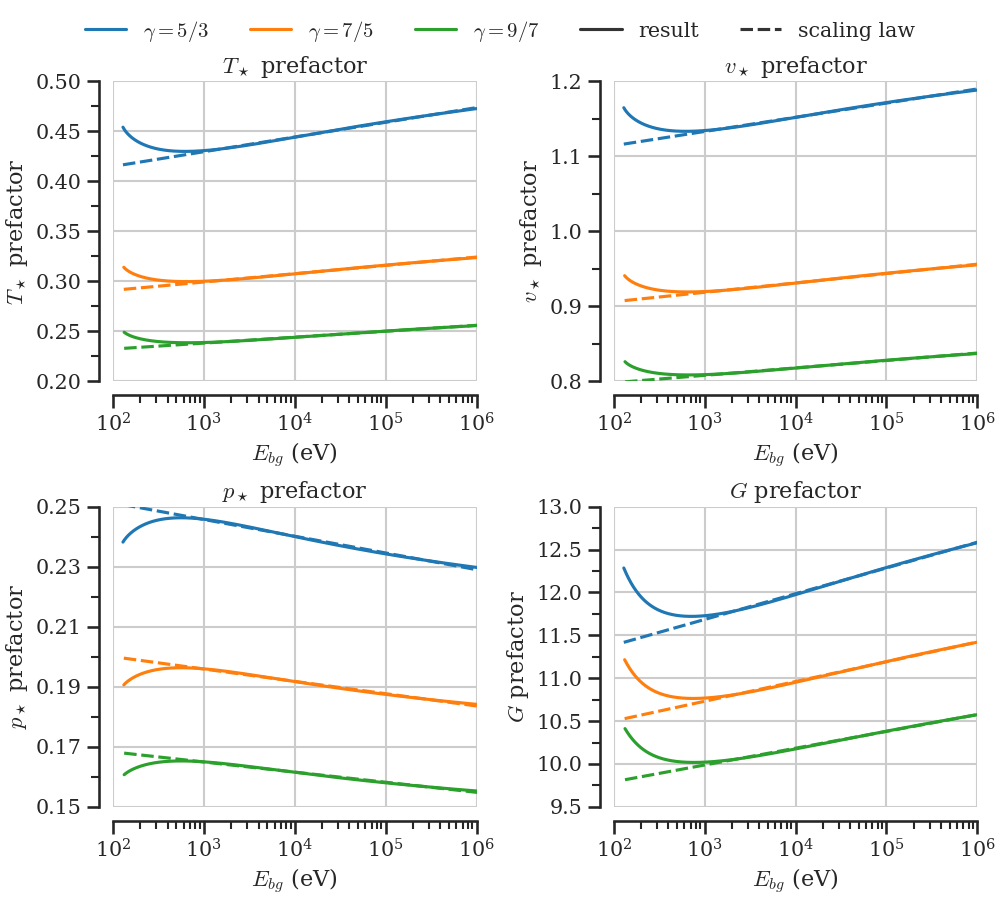
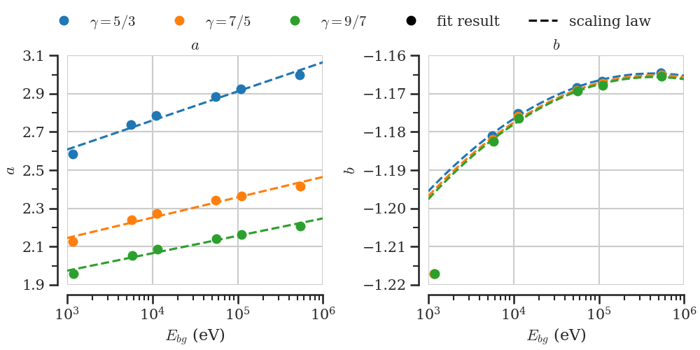

()This document is supposed to give an overview of the project without going into all details.
It should refer to other notes or documents that contain the necessary details. It should also state which parts of the project are done (provisionally) and potentially where I'm working on. As the steps of this project might change, this is an evolving document, unlike the planning report, which was how we envisioned the project at the start.
Oskars summary is more detailed than this document and includes all necessary details. (see [Summary_by_Oskar_2024-02-09](CollaborationDocuments/Summary_by_Oskar_2024-02-09.pdf)) The other notes I refer to here give the full derivations and are therefore even more detailed.

✅ -> Done  
🔥 -> Currently working on  
⏳ -> Partly done, but not working on currently  
⛔ -> Not started yet  

# Overall goals

In magnetic confinement fusion, an important part of disruption mitigation, plasma control and refueling is pellet injection (small balls of frozen Deuterium or Tritium). It has been observed in experiments that there is an outwards acceleration on the pellet once it is inside the plasma. (see [Pegourie-2007](LiteratureNotes/Pegourie-2007.md)) The cause and magnitude of this acceleration is not well understood so far. It is believed that a major contribution to this is the so-called pellet rocket effect, which is the topic of this project. 

Cause of the rocket effect is an asymmetric heating of the otherwise almost spherical neutral gas cloud around the pellet. Many models exist which model the gas cloud under symmetric heating. One that has proven to accurately predict the ablation rate of the pellet is the Neutral Gas Shielding (NGS) model by [Parks-1978](LiteratureNotes/Parks-1978.md). This model contains many approximations and assumptions, but more sophisticated models got essentially the same results. (see [Pegourie-2007](LiteratureNotes/Pegourie-2007.md)) Therefore, we decided to model the rocket effect by taking the NGS model as a baseline and add on top of it a perturbation to first order (linearization) that has an asymmetric heat flux. The model is a semi-analytical quasi-steady-state model of the fluid dynamics inside the neutral part of the ablation cloud. The ionized part, the background plasma and the pellet itself are seen as boundary conditions.

The final goal of this project is to have a model, where we can have the plasma and pellet parameters as inputs and it calculates the net force on the pellet. In the intermediate steps it is however possible and necessary to solve the zeroth order and then the first order differential equations for the gas. Therefore, this model can also be used if other fluid quantities of the neutral gas at some spatial position are of interest.

# Neutral Gas Shielding model (0th order)

This part is basically replicating the paper by [Parks-1978](LiteratureNotes/Parks-1978.md) with both deriving the equations and solving them numerically. However, the scaling laws are not rederived here.

## Derivation of the set of equations (0th order) ✅

Starting from ideal gas fluid dynamics equations, a set of equations has been derived for the spherically symmetric part of the neutral gas around the pellet. (derivation in [full_derivation_more_clean](HandwrittenNotes/full_derivation_more_clean.pdf)) These equations describe the following quantities at radius $r$: mass density $\rho_0$ , fluid velocity $v_0$ , pressure $p_0$ , temperature $T_0$ , heat flux $q_0$ , average energy of incoming electrons $E_0$ 
All of these quantities are then normalized to their value at the sonic radius, denoted with a star ($\rho_0 \rightarrow \rho_0/\rho_\star$), to get dimensionless quantities of order 1. And the set of equations for the normalized quantities is derived. (in [normalized_zeroth_order_eqs](HandwrittenNotes/normalized_zeroth_order_eqs.pdf)) The final set of differential equations (dropping the index 0) is (eq. 16 - 19 in [Parks-1978](LiteratureNotes/Parks-1978.md))
$$
\begin{align}
    &\frac{dv^2}{dr} = \frac{4v^2T}{(T-v^2)r}\left(\frac{q\Lambda r}{T\sqrt{v^2}} -1\right)\\
    &\frac{dT}{dr} = \frac{2\Lambda q}{\sqrt{v^2}}-\frac{1}{2}(\gamma -1)\frac{dv^2}{dr}\\
    &\frac{dE}{dr} = 2\lambda _\star\frac{L}{r^2\sqrt{v^2}}\\
    &\frac{dq}{dr} = \lambda _\star\frac{q\Lambda }{\sqrt{v^2}r^2},
\end{align}
$$
Where $\Lambda(E)$ and $L(E)$ are normalized empirical functions for the energy attenuation cross section, given in [Parks-1978](LiteratureNotes/Parks-1978.md), i.e. known functions of $E$. However, in order to calculate the normalized versions of those functions, the value of $E_\star$ has to be known. The unknown values of the quantities at the sonic radius cancelled out of most of the equations and the remaining quantities could be combined into one unknown parameter $\lambda_\star = r_\star\Lambda _\star p_\star/T_\star$ . Since we have normalized the quantities, we know their values at the sonic radius ($r=1$): 
$$
v(r=1)=1 \quad,\quad T(r=1)=1 \quad,\quad E(r=1)=1 \quad,\quad q(r=1)=1
$$
Boundary conditions that apply to both the normalized and non-normalized quantities are:
$$
T(r_p)=0 \quad,\quad q(r_p)=0 \quad,\quad q(\infty)=q_{bg} \quad,\quad E(\infty)=E_{bg} \quad,\quad p(\infty)=0
$$
While the non-normalized pellet radius $\bar{r}_p$ is an input parameter, the normalized pellet radius $r_p$ is not known since $r_\star$ is not known.

## Solving the differential equations numerically (0th order) ✅ 

The normalized set of equations has two unknown parameters ($E_\star$ and $\lambda_\star$). If those parameters are known, the equations can be integrated starting from $r=1$.
So most of the work done in this part is to find values of $E_\star$ and $\lambda_\star$ for which all of the boundary conditions are fulfilled and by that also infer the unknown boundary $r_p$ . The full detail of this part are written in [Numerical procedure 0th order](Numerical%20procedure%200th%20order.md), but the following is a short summary.

The first step is to choose some $E_\star$ (similar order of magnitude as $E_{bg}$) and $\lambda_\star$ (between 0 and 1). Then solve the initial value problem from $r=1$ downwards numerically. Here, I use the function [scipy.integrate.solve_ivp](https://docs.scipy.org/doc/scipy/reference/generated/scipy.integrate.solve_ivp.html). Evaluate if there is a point where both $T$ and $q$ go to 0. If it is not fulfilled sufficiently vary $\lambda_\star$ until you find one where all boundary conditions are fulfilled. For this purpose I use [scipy.optimize.root](https://docs.scipy.org/doc/scipy/reference/generated/scipy.optimize.root.html) to find the $\lambda_\star$ where $(T(r_p)-q(r_p))$ crosses 0.  ✅

One example solution, which is also shown in figure 4 of [Parks-1978](LiteratureNotes/Parks-1978.md) is shown in the following figure.

Once $E_\star, \lambda_\star, r_p$ are determined, the ODE system can be integrated from $r=1$ upwards until $q$ and $E$ are converged to some constant value. This is needed to calculate which $E_{bg}$ the chosen $E_\star$ corresponds to. $q_{bg}$ can then be calculated through eq. 1 in Parks, which would yield $q_\star$. ✅ 

With all relations outlined in [numerics_outline_spherical_part](HandwrittenNotes/numerics_outline_spherical_part.pdf) (ignore the "make boundary value problem") one can now calculate all non-normalized values and the full zeroth order system is solved. After solving the ODE numerically for a given $\gamma, E_\star$ the dimensionless quantities $\lambda_\star, r_p, E_\infty, q_\infty$ are known. This directly gives the physical quantities $r_\star, E_{bg}, q_\star$. The remaining physical quantitites needed are $T_\star, v_\star, p_\star, G$. Formulas for these are given in [remaining_quantities_and_fits](HandwrittenNotes/remaining_quantities_and_fits.pdf). 
With the most important one for the pellet rocket force being
$$
p_\star = \left( \frac{\lambda_\star r_p}{4 q_\infty^2} \cdot \frac{(\gamma - 1)^2}{\gamma} \right)^\frac{1}{3} \left[ \frac{m (\mu q_{bg})^2}{\Lambda_\star \widetilde{r}_p} \right]^\frac{1}{3}
$$
Where the first part is dimensionless, $\mu$ is a model parameter determining the fraction of heat flux converted into heating the neutral gas (Parks: $\mu\approx 0.6 - 0.7$) and the rest are physical input parameters. After calculating all dimensionless quantities (or prefactors) scaling laws of the form
$$
f(E_{bg}) = a_0 + a_1 \log_{10}E_{bg}
$$ are fitted. With this, the zeroth order is fully solved and all physical quantities can be calculated given the physical input parameters $\gamma,E_{bg},q_{bg},r_p, m$. ✅ 

The zeroth order scan results and the corresponding scaling laws are shown in the following figures. This can also be compared with figures 1 and 2 in [Parks-1978](LiteratureNotes/Parks-1978.md).

# Asymmetric perturbation to NGS (1st order)

From here on we assume the solution to the zeroth order is known and we add a first order perturbation that depends not only on $r$ (like the NGS model) but also on $\theta$. The idea and first derivation was proposed by Per Helander and is in [Initial_derivations_by_Per](CollaborationDocuments/Initial_derivations_by_Per.pdf).

## Derivation of the set of equations (1st order) ✅

The perturbation is taken to be of the form $p(\vec{r})=p_0(r)+p_1(r,\theta)$ and $\vec{v}(\vec{r})=v_0(r)\hat{r} + u_1(r,\theta)\hat{r}+ v_1(r,\theta)\hat{\theta}$ and the first order is assumed to be much smaller than the zeroth order, so that the system of equations can be linearized. Each first order quantity is then expanded in a general orthogonal basis $\{X_l(\theta)\}$ like $T_1(r,\theta) = \sum_l \mathcal{T}_l(r) X_l(\theta)$. Except for $v_1$ which is expanded in a different general basis $\{Y_l( \theta )\}$, because that is needed to later be able to separate the $r$- and $\theta$-dependence.

Inserting this expansion into the original set of fluid equations leads then to a set of equations for the radial part. When requiring that the $\theta$-dependence is separated in the equations from the $r$-dependence, this gives us equations for $X_l$ and $Y_l$. It turns out $X_l(\theta)$ have to be the [associated Legendre polynomials](https://en.wikipedia.org/wiki/Associated_Legendre_polynomials), which is convenient, because this way the solutions are already known and the $\theta$-dependence is set. All of this leads to a set of 6 equations for the radial part of the first order quantities for each $l$. The full derivation can be seen in [full_derivation_more_clean](HandwrittenNotes/full_derivation_more_clean.pdf). ✅ 

The zeroth order boundary conditions and the perturbation requirement leads to the following boundary conditions for the first order:
$$
\begin{gather}
\mathcal{T}_l(r_p) = 0,\quad Q_l(r_p)=0,\quad U_l(r_p)=0,\quad V_l(r_p)=0 \\
P_l(\infty) = 0,\quad Q_l(\infty)=\int_0^\pi q_1(r\rightarrow\infty,\theta) X_l(\theta) d\theta,\quad  \mathcal{E}_l(\infty) = \int_0^\pi E_1(r\rightarrow\infty,\theta) X_l(\theta) d\theta 
\end{gather}
$$
✅ 

In the derivation of the force on the pellet (further down), it turns out that only the $l=1$ ($X_1(\theta)=\cos\theta$, $Y_1(\theta)=-\sin\theta$) mode contributes. Therefore, from now on only this mode is considered. For the normalization of the first order quantities, two factors are introduced which encode the relative contribution of the asymmetry in the background heat flux $q_{rel}=Q_1(\infty)/q_{bg}$ and the energy of the incoming electrons $E_{rel}=\mathcal{E}_1(\infty)/E_{bg}$. Then all first order quantities are normalized in the form $P_1(r)=\widetilde{P}_1(r) / p_\star q_{rel}$. This leads to a very similar set of 6 equations. (see [normalized_first_order_eqs](HandwrittenNotes/normalized_first_order_eqs.pdf)) This system of equations can be written as the matrix-vector equation (see [first_order_ode_as_matrix_vector_equation](HandwrittenNotes/first_order_ode_as_matrix_vector_equation.pdf))
$$
A(r) \cdot \frac{d \vec{y}_1}{dr} = B(r) \cdot \vec{y}_1(r), \quad \text{with} \quad \vec{y}_1(r)=\left[P_1(r), \mathcal{T}_1(r), U_1(r), V_1(r),Q_1(r),\mathcal{E}_1(r) \right]^T
$$
where $A$ and $B$ are matrices which only depend on the normalized zeroth order $\vec{y}_0(r)$, $\gamma$, $E_\star$ and $\lambda_\star$. Calculating $C=A^{-1} \cdot B$ analytically (using [SymPy](https://www.sympy.org/en/index.html) for convenience) and handling an appearing singularity at $r=1$ leads to a numerically solvable matrix differential equation with the boundary conditions
$$
\begin{gather}
\mathcal{T}_1(r_p) = 0,\quad Q_1(r_p)=0,\quad U_1(r_p)=0,\quad V_1(r_p)=0 \\
P_1(\infty) = 0,\quad Q_1(\infty)=q_0(\infty),\quad \mathcal{E}_1(\infty)=E_0(\infty)\cdot\frac{E_{rel}}{q_{rel}}
\end{gather}
$$
✅ 

## Solving the differential equations numerically (1st order) ✅ 

The normalized 6x6 matrix-vector differential equation is solved here in a very similar way like the zeroth order for a choice of $\gamma$,$E_\star$,$E_{rel}/q_{rel}$. The full details are given in [Numerical procedure 1st order](Numerical%20procedure%201st%20order.md) (to be written). 

Applying L'Hopitals rule to the apparent singularity in the first 3 rows of $C(r=1)$ yields a relation to eliminate one unknown of the first order quantities at the sonic radius. Otherwise, no relations are known and 5 of the 6 first order quantities at $r=1$ are treated as unknowns that have to be optimized so that the solution satisfies the boundary conditions. ✅ 

For a given $\vec{y}_{1}(r=1)$ the differential equation is solved numerically using [scipy.integrate.solve_ivp](https://docs.scipy.org/doc/scipy/reference/generated/scipy.integrate.solve_ivp.html) down to $r_p$ and up until convergence of $Q_1, \mathcal{E}_1$. The deviation from 5 of the boundary conditions is then used to optimize $\vec{y}_1(r=1)$ using [scipy.optimize.root](https://docs.scipy.org/doc/scipy/reference/generated/scipy.optimize.root.html) . ✅ An example (optimized) solution is shown in the following plot on both linear and logarithmic scales and additionally with the derivatives in the second row of plots. (The important plot is one the top left, which shows that the boundary conditions are satisfied and the pressure reaches a finite value)

The quantity that is most important for the rocket force on the pellet is $P_1(r_p)$ (remember the non-normalized pressure $p(r,\theta)=\widetilde{p}_0(r) + \widetilde{P}_1(r)\cos\theta + \dots$). A parameter scan over mainly $E_{rel}/q_{rel}$ is performed for some choices of $\gamma,E_\star$.✅  For each parameter combination, the values at the sonic radius are optimized, and the resulting $P_1(r_p)$ is shown in the following plots.

It is apparent that $P_1(r_p)$ depends linearly on $E_{rel}/q_{rel}$ with a slope that weakly depends on $\gamma,E_\star$. (this is tested for values  $0.1<|E_{rel}/q_{rel}|<10^6$) Thus, $P_1(r_p)$ can be given as a linear regression to the numerical solutions in the form
$$
P_1(r_p) = a(\gamma,E_{bg})\cdot\left(\frac{E_{rel}}{q_{rel}} - b(\gamma,E_{bg}) \right)
$$
and the regression parameters $a,b$ themselves are given as the scaling laws
$$
a(E_{bg}) = a_0 + a_1 \log_{10}E_{bg}
$$
$$
b(E_{bg}) = b_0 + b_1 \log_{10}E_{bg} + b_2 (\log_{10} E_{bg})^2
$$
This way, calculating the numerical solutions as described above is not necessary to quantify the pellet rocket force. The fit parameter dependence on $E_{bg}$ is shown in the following figure.✅

# Pellet rocket force ✅

Each point in the neutral gas cloud around the pellet has an associated momentum flux tensor $\Pi_{jk}(\vec{r})=p(\vec{r}) + \rho(\vec{r})v_j v_k$ . Momentum conservation at the pellet surface can then be used to calculate the net force which the gas exerts on the pellet through a surface integral. Assuming spherical coordinates and symmetry in the $\varphi$ direction yields the vertical force 
$$
F_z = \left(-\underset{S}{\int} \overset{\leftrightarrow}{\Pi}\cdot\mathrm{d}\vec{S}\right)_z = -2\pi r_p^2 \int_0^\pi\left( \rho v_z v_r + p \cos\theta\right)_{r=r_p} \sin\theta\,\mathrm{d}\theta \,.
$$
Inserting the anisotropic perturbations introduced above, linearizing the integral,  and then solving the integral analytically yields (see [derivation_force_from_perturbation](HandwrittenNotes/derivation_force_from_perturbation.pdf) for more details)✅ 
$$
F_z = - \frac{4}{3}\pi r_p^2 \left( v_0^2 R_1 + 2\rho_0 v_0 (U_1+V_1)+P_1  \right)_{r=r_p} 
$$

Inserting now the chosen normalization of the zeroth and the first order yields a similar equation. (see [force_from_normalized_1st_order](HandwrittenNotes/force_from_normalized_1st_order.pdf)) However, it is found through the numerical solution that (at least for the chosen boundary conditions) $P_1(r_p) \gg (v_0^2 R_1 + 2\rho_0 v_0 (U_1+V_1))_{r=r_p}$ and thus the pellet rocket force becomes (now with  $P_1$ normalized) 
$$
F_z = -\frac{4}{3}\pi r_p^2 p_\star q_{rel} P_1(r_p) \,.
$$  where $r_p$ is the physical pellet radius, $p_\star$ can be calculated through the scaling law found for the zeroth order and $P_1(r_p)$ is the normalized pressure perturbation and can be calculated through the scaling law found for the first order. 
Only $E_{rel}$ and $q_{rel}$ are not known yet and some model has to be found to describe the heat flux shielding of the plasma cloud and how large the asymmetry of the heat flux is. (this is also needed to calculate $p_\star$ and $P_1(r_p)$). ✅ 
# Modelling the heat flux shielding through the ionized ablation cloud✅

The above described model completely describes the dynamics of the neutral gas cloud around the pellet and how this leads to an acceleration of the pellet. Besides the heat capacity ratio $\gamma$, the ablation particle mass $m$ and the pellet radius $r_p$, the main model inputs are the neutral gas cloud boundary conditions.
Since the neutral ablation cloud is not in direct contact with the background plasma, a model has to be developed for how the incoming electrons are shielded in the ionized part of the ablation cloud. This model should estimate the parameters $E_{bg}, q_{bg},E_{rel},q_{rel}$.

There can be multiple different sources for an asymmetric heat flux on the pellet. This project is however focused on the asymmetry arising along the major radius direction, which is mainly attributed to the drift of the ionized ablation cloud due to the $\nabla \times B$ drift. The plasma cloud can be approximated to be homogeneous in density and temperature. Therefore, the effective heat flux depends on the distance they travel before they reach the neutral gas cloud.

The shielding length is estimated by finding the shape of the boundary between the plasma cloud and the background plasma. The ionized ablated material expands at the sound speed along the field lines. Along the major radius direction, the particles first travel at the pellet velocity and are accelerated through as modelled in Oskars drift paper [Vallhagen-Licentiate-2023](LiteratureNotes/Vallhagen-Licentiate-2023.md). How this can be combined to estimate the shielding length $z(R)$ is detailed in the first part of [plasma_cloud_shielding](HandwrittenNotes/plasma_cloud_shielding.pdf), where $R$ is the place at which the field line hits the pellet along the major radius. The central shielding length is denoted as $z_s$.✅

The important approximation made here is that all electrons having a mean free path shorter than the distance they travel are stopped completely, while the other electrons travel through the plasma cloud unaffected. How this leads to formulas for the heat flux is detailed in the second part of [plasma_cloud_shielding](HandwrittenNotes/plasma_cloud_shielding.pdf). Note that the distance traveled $d$ is longer than the shielding length $z$ by a factor $\xi$ of the cosine of the pitch angle, because the electrons gyrate around the field lines.
Therefore the condition for electrons reaching the neutral cloud is
$$
\frac{z}{\xi} \leq \lambda_\text{mfp}
$$
Since the mean free path mainly depends on the electron velocity $v_e$, a critical velocity can be defined above which the electrons contribute to the heat flux. Defining the thermal velocity $v_{th} = \sqrt{2\frac{k_B T}{m_e}}$ and the mean free path at thermal velocity $\lambda_T$, the critical velocity becomes
$$
v_c = \left(\frac{z_s}{\xi \lambda_T} \right)^\frac{1}{4} v_{th} \, .
$$
Integrating over the allowed velocities in the 3D Maxwellian distribution then yields the heat flux $q_p$ at the neutral gas cloud boundary. The average energy is then estimated as $E_p = \frac{q_p}{\phi_p}$, where $\phi_p$ is the particle flux. (also derived by integrating over the distribution function) This leads to formulas of the form
$$
q_p(R) = q_\text{bg} \cdot f_q(x) \quad \text{and} \quad E_p(R)=E_{bg} \cdot f_E(x)
$$
where $q_{bg} = 2 n_{bg} \sqrt{\frac{T^3}{2 \pi m_e}}$ and $E_{bg}=2T$ are the boundary conditions used in [Parks-1978](LiteratureNotes/Parks-1978.md) and $f_q(x), f_E(x)$ are dimensionless functions depending only on the ratio $x=\lambda_T / z(R)$.

The third section in [plasma_cloud_shielding](HandwrittenNotes/plasma_cloud_shielding.pdf) relates $q_p(R), E_p(R)$ with the boundary conditions of the neutral gas cloud and it's asymmetric perturbation model. A first order Taylor expansion around $R=0$ and noting $R = -\delta R \cos \theta$ then yields
$$
\begin{align}
q_0(r \rightarrow \infty) &= q_p(R=0) \\
E_0(r \rightarrow \infty) &= E_p(R=0) \\
q_{rel} &= - \frac{1}{q_p(R=0)} \frac{\partial q_p}{\partial x}|_{x=x_s} \frac{\partial x}{\partial z}|_{z=z_s} \frac{\partial z}{\partial R}|_{R=0} \delta R \\
q_{rel} &= - \frac{1}{E_p(R=0)} \frac{\partial E_p}{\partial x}|_{x=x_s} \frac{\partial x}{\partial z}|_{z=z_s} \frac{\partial z}{\partial R}|_{R=0} \delta R
\end{align}
$$
where $x_s=x(z=z_s)$. If one considers the projection onto the first Legendre polynomial instead, it is easy to show that $-\frac{dq_p}{dR} \delta R = Q_1(\delta R)$ and higher orders are only related to higher order Legendre polynomials. The variation parameter is assumed to be $\delta R = r_p$, which would mean field lines not hitting the pellet directly do not significantly contribute to the dynamics within the neutral ablation cloud. ✅

Together with relations found in Oskar's drift paper, the boundary conditions to the neutral ablation cloud can be calculated given the pellet velocity $v_p$, the pellet radius $r_p$, the major radius $R_m$, the electron background density $n_{bg}$, the electron background temperature $T_{bg}$ and a suitable ionization radius around the pellet $r_i$.

Note that for the drift depends on the ablation rate, however to estimate the ablation rate from our model the boundary condtions are needed. This means this model needs to be solved self constent so that the predicted ablation rate is the same as the initially used ablation rate.

## Estimating the magnitude of the rocket acceleration ⛔

Now, the semi-analytical model for the pellet rocket force is complete. In order to estimate how important this effect is, typical reactor plasma and pellet parameters need to be found through research (with references). Example parameters could be taken from ITER, JET, ASDEX-U, W7X,... ⛔

