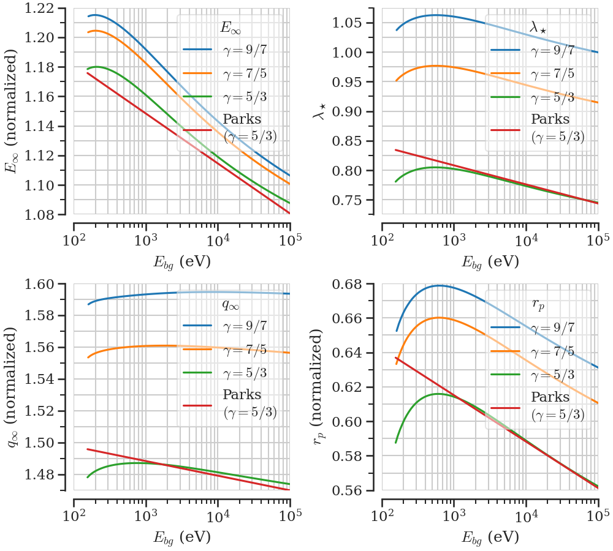
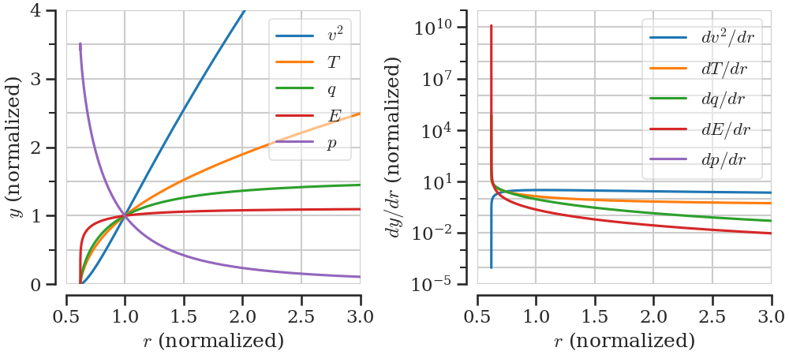

This document is supposed to give an overview of the project without going into all details.
It should refer to other notes or documents that contain the necessary details. It should also state which parts of the project are done (provisionally) and potentially where I'm working on. As the steps of this project might change, this is an evolving document, unlike the planning report, which was how we envisioned the project at the start.
Oskars summary is more detailed and includes all necessary details. (see [Summary_by_Oskar_2024-02-09](CollaborationDocuments/Summary_by_Oskar_2024-02-09.pdf))

✅ -> Done  
🔥 -> Currently working on  
⏳ -> Partly done, but not working on currently  
⛔ -> Not started yet  

# Overall goals

In magnetic confinement fusion, an important part for disruption mitigation, plasma control and refueling is pellet injection (small balls of frozen Deuterium or Tritium). It has been observed in experiments that there is an outwards acceleration on the pellet once it is inside the plasma. (see [Pegourie-2007](LiteratureNotes/Pegourie-2007.md)) The cause and magnitude of this acceleration is not well understood so far. It is believed that a major contribution to this is the so-called pellet rocket effect, which is the topic of this project. 

Cause of the rocket effect is an asymmetric heating of the otherwise almost spherical neutral gas cloud around the pellet. Many models exist which model the gas cloud under symmetric heating. One that has proven to accurately predict the ablation rate of the pellet is the Neutral Gas Shielding (NGS) model by [Parks-1978](LiteratureNotes/Parks-1978.md). This model contains many approximations and assumptions, but more sophisticated models got essentially the same results. (see [Pegourie-2007](LiteratureNotes/Pegourie-2007.md)) Therefore, we decided to model the rocket effect by taking the NGS model as a baseline and add on top of it a perturbation to first order (linearization) that has an asymmetric heat flux. The model is a semi-analytical model of the fluid dynamics inside the neutral part of the ablation cloud. The ionized part, the background plasma and the pellet itself are seen as boundary conditions.

The final goal of this project is to have a model, where we can have the plasma and pellet parameters as inputs and it calculates the net force on the pellet. In the intermediate steps it is however possible and necessary to solve the zeroth order and then the first order differential equations for the gas. Therefore, this model can also be used if other fluid quantities of the neutral gas at some spatial position are of interest.

# Neutral Gas Shielding model (0th order)

This part is basically replicating the paper by [Parks-1978](LiteratureNotes/Parks-1978.md) with both deriving the equations and solving them numerically. However, the scaling laws are not rederived here.

## Derivation of the set of equations ✅

Starting from ideal gas fluid dynamics equations, a set of equations has been derived for the spherically symmetric part of the neutral gas around the pellet. (derivation in [full_derivation_more_clean](HandwrittenNotes/full_derivation_more_clean.pdf)) These equations describe the following quantities at radius $r$: mass density $\rho_0$ , fluid velocity $v_0$ , pressure $p_0$ , temperature $T_0$ , heat flux $q_0$ , average energy of incoming electrons $E_0$ 
All of these quantities are then normalized to their value at the sonic radius, denoted with a star ($\rho_0 \rightarrow \rho_0/\rho_\star$), to get dimensionless quantities of order 1. And the set of equations for the normalized quantities is derived. (in [normalized_zeroth_order_eqs](HandwrittenNotes/normalized_zeroth_order_eqs.pdf)) The final set of differential equations (dropping the index 0) is (eq. 16 - 19 in [Parks-1978](LiteratureNotes/Parks-1978.md))
$$
\begin{align}
    &\frac{dv^2}{dr} = \frac{4v^2T}{(T-v^2)r}\left(\frac{q\Lambda r}{T\sqrt{v^2}} -1\right)\\
    &\frac{dT}{dr} = \frac{2\Lambda q}{\sqrt{v^2}}-\frac{1}{2}(\gamma -1)\frac{dv^2}{dr}\\
    &\frac{dE}{dr} = 2\lambda _\star\frac{L}{r^2\sqrt{v^2}}\\
    &\frac{dq}{dr} = \lambda _\star\frac{q\Lambda }{\sqrt{v^2}r^2},
\end{align}
$$
Where $\Lambda(E)$ and $L(E)$ are empirical functions for the energy attenuation cross section, given in [Parks-1978](LiteratureNotes/Parks-1978.md), i.e. known functions of $E$. However, in order to calculate the normalized versions of those functions, the value of $E_\star$ has to be known. The unknown values of the quantities at the sonic radius cancelled out of most of the equations and the remaining quantities could be combined into one unknown parameter $\lambda_\star = r_\star\Lambda _\star p_\star/T_\star$ . Since we have normalized the quantities, we know their values at the sonic radius ($r=1$): 
$$
v(r=1)=1 \quad,\quad T(r=1)=1 \quad,\quad E(r=1) \quad,\quad q(r=1)=1
$$
Boundary conditions that apply to both the normalized and non-normalized quantities are:
$$
T(r_p)=0 \quad,\quad q(r_p)=0 \quad,\quad q(\infty)=q_{bg} \quad,\quad E(\infty)=E_{bg} \quad,\quad p(\infty)=0
$$
While the non-normalized pellet radius $\bar{r}_p$ is an input parameter, the normalized pellet radius $r_p$ is not known since $r_\star$ is not known.

## Solving the differential equations numerically 🔥

The normalized set of equations has two unknown parameters ($E_\star$ and $\lambda_\star$). If those parameters are known, the equations can be integrated starting from $r=1$.
So most of the work done in this part is to find values of $E_\star$ and $\lambda_\star$ for which all of the boundary conditions are fulfilled and by that also infer the unknown boundary $r_p$ .

The first step is to choose some $E_\star$ (similar order of magnitude as $E_{bg}$) and $\lambda_\star$ (between 0 and 1). Then solve the initial value problem from $r=1$ downwards numerically. Here, I use the function [scipy.integrate.solve_ivp](https://docs.scipy.org/doc/scipy/reference/generated/scipy.integrate.solve_ivp.html). Evaluate if there is a point where both $T$ and $q$ go to 0. If it is not fulfilled sufficiently vary $\lambda_\star$ until you find one where all boundary conditions are fulfilled. For this purpose I use [scipy.optimize.root](https://docs.scipy.org/doc/scipy/reference/generated/scipy.optimize.root.html) to find the $\lambda_\star$ where $(T(r_p)-q(r_p))$ crosses 0. ✅ 

Once $E_\star, \lambda_\star, r_p$ are determined, the ODE system can be integrated from $r=1$ upwards until $q$ and $E$ are converged to some constant value. This is needed to calculate which $E_{bg}$ the chosen $E_\star$ corresponds to. $q_{bg}$ can then be calculated through eq. 1 in Parks, which would yield $q_\star$. ✅ 

With all relations outlined in [numerics_outline_spherical_part](HandwrittenNotes/numerics_outline_spherical_part.pdf) (ignore the "make boundary value problem") one could now theoretically calculate all non-normalized values and the full zeroth order system is solved. ⛔ 

Since this model needs $E_\star$ as an input, but in reality $E_{bg}$ is an input parameter, it is important to find a formula to calculate $E_\star(E_{bg})$. Additionally, if one does not want to execute the whole algorithm, one would also need expressions for $\lambda_\star$, $r_p$ and $q_\star(q_{bg})$. Those relations are given in eq. 22 - 26 in [Parks-1978](LiteratureNotes/Parks-1978.md) and won't be refitted here. However, to evaluate if my algorithm is correct, I want to recreate figures 1, 2 and 4 in [Parks-1978](LiteratureNotes/Parks-1978.md). ✅

# Asymmetric perturbation to NGS (1st order)

From here on we assume the solution to the zeroth order is known and we add a first order perturbation that depends not only on $r$ (like the NGS model) but also on $\theta$. The idea and first derivation was proposed by Per Helander and is in [Initial_derivations_by_Per](CollaborationDocuments/Initial_derivations_by_Per.pdf).

## Derivation of the set of equations ⏳

The perturbation is taken to be of the form $p(\vec{r})=p_0(r)+p_1(r,\theta)$ and $\vec{v}(\vec{r})=v_0(r)\hat{r} + u_1(r,\theta)\hat{r}+ v_1(r,\theta)\hat{\theta}$ and the first order is assumed to be much smaller than the zeroth order, so that the system of equations can be linearized. Each first order quantity is then expanded in a general orthogonal basis $\{X_l(\theta)\}$ like $T_1(r,\theta) = \sum_l \tau_l(r) X_l(\theta)$. Except for $v_1$ which is expanded in a different general basis $\{Y_l( \theta )\}$, because that is needed to late be able to separate the $r$- and $\theta$-dependence.

Inserting this expansion into the original set of fluid equations leads then to a set of equations for the radial part. When requiring that the $\theta$-dependence is separated in the equations from the $r$-dependence, this gives us equations for $X_l$ and $Y_l$. It turns out they have to be the [associated Legendre polynomials](https://en.wikipedia.org/wiki/Associated_Legendre_polynomials), which is convenient, because this way the solutions are already known and the theta dependence is set. All of this leads to a set of 6 equations for the radial part of the first order quantities. The full derivation can be seen in [full_derivation_more_clean](HandwrittenNotes/full_derivation_more_clean.pdf). ✅ 

The boundary conditions are already set, but I have to make them more clear in my head. ⛔ 

The first order quantities are normalized to the value at the sonic radius times $q_{rel}$, which is the relative contribution of the asymmetric background heatflux to the total background heatflux. This leads to a very similar set of 6 equations. Oskar has derived those, but I still have to derive them myself. ⛔ 

## Solving the differential equations numerically

(to be written)

# Pellet rocket force ⏳

## Derivation of the force ✅ 

(to be written)

## Estimating the magnitude of the rocket acceleration ⛔ 

(to be written)

